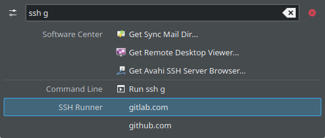

# SSH Runner

A KRunner backend for connecting to SSH hosts listed in your known_hosts file.

## Installation

### Automatic installation

Simply execute the `install.sh` script and you are ready to go.

### Manual installation

* Copy [ssh-runner.desktop](ssh-runner.desktop) to ~/.local/share/kservices5
* Copy [ssh-runner.service](ssh-runner.service) to ~/.local/share/dbus-1/services/com.selfcoders.ssh-runner.service
* Replace "%{BASE_DIR}" with the path to the folder containing the runner.py in ~/.local/share/dbus-1/services/com.selfcoders.ssh-runner.service
* Restart KRunner using `kquitapp5 krunner`

## Terminal Command

As every terminal emulator has different options on how to start a new SSH session, you can specify the command to open the SSH session as arguments passed to `runner.py`.

The `{}` placeholder will be replaced by the hostname.

Examples:

* Konsole: `konsole -e 'ssh {}'` (default)
* [Tilix](https://gnunn1.github.io/tilix-web/): `tilix -e 'ssh {}'`
* GNOME Terminal: `gnome-terminal -- ssh {}`

Example call: `/path/to/runner.py konsole -e 'ssh {}'`

## Usage

Open KRunner (usually Alt+F2) and search for a host listed in your known_hosts file.

Note: Make sure to disable hashing of your known_hosts file (`HashKnownHOsts no` in your ~/.ssh/config), otherwise SSH Runner can't find any hosts from your known_hosts file.